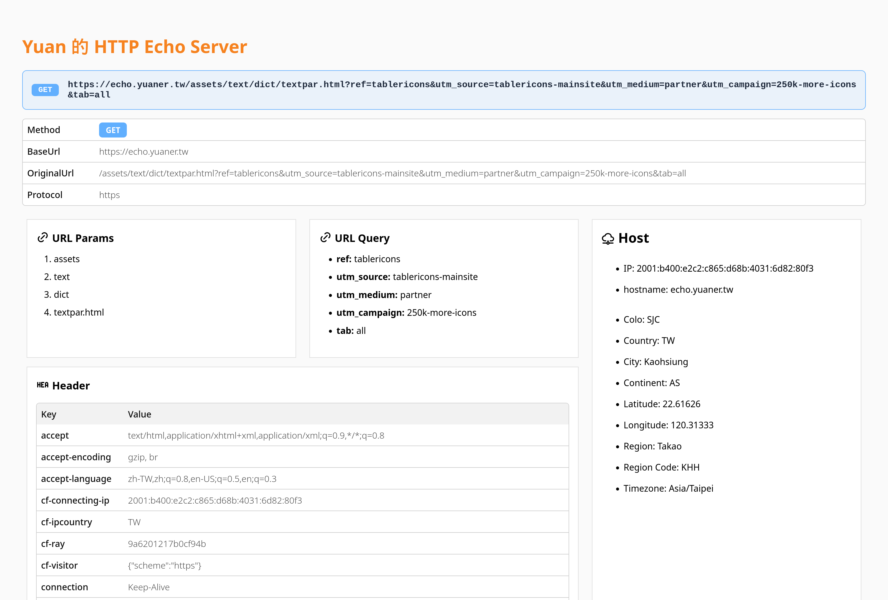
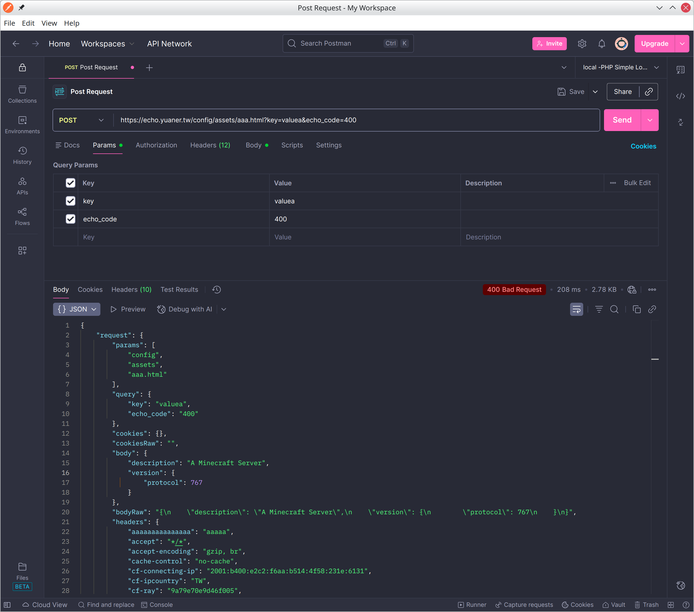
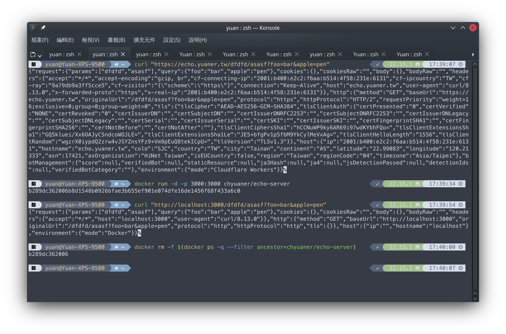

Yuan 的 HTTP Echo Server
===
本專案是提供CDN Edge層級的http回音鸚鵡伺服器（也提供本機端獨立運作的方式）

就如字面上所說的，你對我發出的Request後，我的伺服器就會把我從你這邊接到的資訊：以什麼網址字串、帶了什麼Post Body、Request Header，一五一實的以ResponseBody方式回應給你。

同時也可以當作MyIP查詢使用，會顯示在「Host」區塊。

Demo <https://echo.yuaner.tw/assets/text/dict/textpar.html?ref=tablericons&utm_source=tablericons-mainsite&utm_medium=partner&utm_campaign=250k-more-icons&tab=all>





## ✨ 專案特色
* 主要針對Cloudflare Workers設計，**在CDN Edge層級直接提供完整服務**，不需在自有主機架設，理論上極致效能低延遲
    * 亦有提供Docker快速架設方案，可用單行指令就可以快速啟動本伺服器，方便臨時測試用。
    * 也有提供傳統獨立啟動本後端程式的功能（`npm run start`），可掛上pm2或systemd，供內部或特殊情況使用。
* 預設以JSON格式作為Response Body輸出（主要由Header `accept`控制輸出格式），可用於Postman、Paw、Insomnia、Hoppscotch等HTTP API調試客戶端使用。
* **有設計精美的網頁UI界面**（當Header為 `accept: text/html` 就會以網頁顯示，一般瀏覽器預設會帶入），降低辨識判讀的負擔
    * 有特別為 **「URL Params」、「URL Query」區塊特別設計友善文字複製** 。界面乍看下是ul li項目清單，但圈選文字後，會直接複製成可直接貼上網址列的字串
    * 本網頁兼顧美觀與效能考量，未使用前端框架，100%原生CSS排版撰寫、無額外多餘複雜的JavaScript執行邏輯（Syntax Highlight用的除外）。
    * **網頁版不會產生額外Request載入其他資源！**（像是圖片、CSS、JS等等）
        * 所有外部資源如Icons與Syntax Highlight JS都已直接內嵌在單一這個Request。
    * 有特別花心力調整 小平板 與 手機版的UI界面，尤其是表格有特別真對手機版設計過。
    * 也有花心力調整過適合Dark Mode的配色
* 支援Facebook、Telegram、Discord連結摘文，**在預覽圖直接顯示Echo內容**（可直接用預覽圖Debug），可拿來作為觀察其他平台的流量行為使用。
    * 在網址參數帶入 `echo_png=1` 將會直接輸出成png圖片。並整合到 `og:image` meta標籤使用
    * 因應本需求，所設置的meta標籤也是以直接輸出Echo內容，方便你Debug用。（不過因為平台摘文都有字數限制，內容優先順序還有待優化）
* 提供 URL Query 參數 `echo_code=200` or Header `X-ECHO-CODE: 200` 控制要回傳的 HTTP Status Code
* 提供 URL Query 參數 `echo_time=3000` or Header `X-ECHO-TIME: 3000` 控制伺服器要延遲多久才會送 Response ，給你模擬較差網路品質狀況使用

## 🛠️ 部署方式
注意！ GeoIP資料（Host相關的：Colo, Country, City, Continent, ASN, As Organization, Region, Region Code, Timezone等）是直接取用Cloudflare提供的，本程式暫無自身取得GeoIP資料的功能，所以以其他非Cloudflare Worker的方式會沒有這些資訊。

### 🚀 部署到 Cloudflare Workers （推薦方式）

#### 一鍵快速部署

[](https://deploy.workers.cloudflare.com/?url=https://github.com/chyuaner/cloudflare-echo-server)

#### 手動建置
1. **登入 Cloudflare**（如果尚未登入）
   ```bash
   npx wrangler login
   ```

2. **發布到預設環境**
   ```bash
   npx wrangler publish
   ```

   - `wrangler.jsonc` 中的 `name: "cloudflare-echo-server"` 會成為 Workers 的子域名或路由。
   - `compatibility_date` 設為 `2025-04-03`，確保使用最新的 Workers Runtime。


### 📦 Docker快速部署
#### 直接從Docker Hub快速使用
```bash
docker run -p 3000:3000 --pull=always chyuaner/echo-server
```

#### 以背景方式從Docker Hub快速使用

##### 以背景方式啟動
```bash
docker run -d -p 3000:3000 --pull=always chyuaner/echo-server
```

##### 關閉這個後端
```bash
docker ps -q --filter ancestor=chyuaner/echo-server | xargs -r docker stop
```

##### 關閉這個後端，並移除該Container
```bash
docker rm -f $(docker ps -q --filter ancestor=chyuaner/echo-server)
```

#### 使用範例



<details>
  <summary>以這份原始碼去Build</summary>

```bash
docker build -t yuan-echo-server .
docker run --rm -p 3000:3000 yuan-echo-server
```

</details>


### 📦 當作傳統後端程式獨立啟動
```bash
npm i
npm run start
```

將會啟動在 3000 Port。

---

## 📂 目錄結構

- **主要入口**: `src/index.js`（在 `wrangler.jsonc` 中指定）
- **HTML 產生器**: `src/generateHtml.js`
- **TypeScript 設定**: `tsconfig.json`
- **部署設定**: `wrangler.jsonc`

```
.
├─ src/
│   ├─ core.js           # Workers 主程式入口
│   └─ node.js           # 由NodeJS自身獨立啟動伺服器專用
│   └─ html.js           # 產生 HTML 的輔助函式
│   └─ og.js             # 產生 png 圖檔
│   └─ snippets.js       # 產生 Request curl測試片段 的輔助函式
├─ tsconfig.json         # TypeScript 編譯選項（允許 .js、.json）
└─ wrangler.jsonc        # Wrangler 部署與環境設定
```

## 📚 參考文件

* 基礎參考： ealen/echo-server <https://ealenn.github.io/Echo-Server/>
* Icons: <https://tabler.io/icons>
* Highlight: <https://prismjs.com/>

- **Wrangler 設定**: <https://developers.cloudflare.com/workers/wrangler/configuration/>
- **Cloudflare Workers Runtime API**: <https://developers.cloudflare.com/workers/runtime-apis/>
- **TypeScript `tsconfig.json` 說明**: <https://aka.ms/tsconfig.json>

## 授權
本專案採用 Apache License 2.0 ，授權條文請見`LICENSE`檔案。

This project was originally released under the MIT License.
As of **2026-01-06**, it is licensed under the **Apache License 2.0**.
See the `LICENSE` file for full terms.
